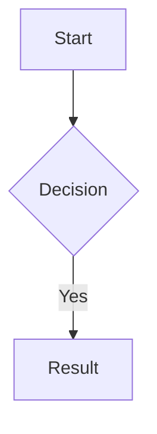

# NotesApp — Product Specification

## 1. Overview

A desktop note-taking application, designed for **AI-assisted research and learning**. The user augments AI-generated content with notes and reference material obtained elsewhere (PDFs, markdown, and other documents). The application supports arbitrary text file authoring and, for rich markdown documents (with LaTeX equations and Mermaid diagrams), real-time WYSIWYG editing and drawing tools.  The application also provides a reference document library (with built in rendering for PDF and markdown documents), and independent chat panels connected to an AI backend (initially Claude).

All data — notes, reference documents, and AI conversation context — is stored in a **project data directory** on the local filesystem, independent of the application installation. No cloud sync is required or assumed.  The user may elect to use `git` to manage persistence and revision control of the project files, but that is beyond the scope of this application.

The application UI is a **native desktop window** powered by an embedded webview (Tauri). It is not accessed through a web browser, except for debugging and integration tests.

A secondary purpose of this project is as a testbed for learning about and evaluating the use of Claude Code in order to develop a project such as this.  The end result is absolutely to be an application that can be installed on a target system, but along the way, it is anticipated that much will be learned about the use of Claude Code in specifying and developing an application such as this.

---

## 2. Application Architecture

### 2.1 Target Platform

- **Target platform:** M1 chipset based macOS (primary), with Linux/Windows portability desirable
- **Framework:** [Tauri v2](https://tauri.app/) (Rust backend + web frontend) — **confirmed, not revisitable**
  - Lighter than Electron; native OS integration; strong file-system access via Rust
  - The webview is embedded in a native window — users never navigate to a URL in their browser

> **Webview compatibility note:** Development occurs on x86 Ubuntu 24.04 (WebKitGTK webview).
> Production target is macOS Apple Silicon (WKWebView). These webviews are close but not
> identical. Known risk areas: canvas rendering (Excalidraw), font antialiasing, CSS
> `backdrop-filter`. Any divergence discovered during development must be documented in
> `COMPAT.md` at the repository root.

#### 2.1.1 Development Platform

The primary development platform for this application is an x86 Ubuntu 24.04 LTS Linux VM with Claude Code, Google Chrome, and the "Claude in Chrome" extension installed. Claude Code performs most of the development, debugging, and integration testing in that environment. Chrome / Claude in Chrome are available for visual debugging, but all automated tests must run without human observation, using `Xvfb` for headless display.

### 2.2 Frontend Stack

| Concern | Library |
|---|---|
| UI framework | React 18 (with TypeScript, strict mode) |
| Layout / pane splitting | [react-mosaic](https://github.com/nomcopter/react-mosaic) — arbitrary tiling layout (see §4) |
| Markdown editor | [CodeMirror 6](https://codemirror.net/) with markdown language support |
| Markdown rendering | [unified](https://unifiedjs.com/) / remark / rehype pipeline |
| LaTeX rendering | [KaTeX](https://katex.org/) (fast, offline) |
| Diagram rendering | [Mermaid.js](https://mermaid.js.org/) |
| WYSIWYG rich-text editing | [Tiptap](https://tiptap.dev/) (ProseMirror-based; supports markdown, bold/italic/lists) |
| Shared document model (CRDT) | [Yjs](https://yjs.dev/) with `y-codemirror.next` and `y-prosemirror` bindings |
| Drawing / annotation | [Excalidraw](https://excalidraw.com/) embedded as a React component |
| PDF rendering | [PDF.js](https://mozilla.github.io/pdf.js/) |
| State management | Zustand |
| Styling | Tailwind CSS + CSS custom properties for theming |
| Build tool | Vite |

### 2.3 Backend (Rust / Tauri)

- File I/O: read/write notes, references, attachments, AI context files
- AI proxy: forward requests to Claude API (or other backends); manage API keys from local config; stream responses back to frontend
- **Project-wide search and retrieval:** full-text search over all notes and reference documents in the project, exposed as a tool that the AI backend can call (see §7.2)
- PDF text extraction for indexing (using `pdf-extract` or `pdfium`)
- Search engine: [Tantivy](https://github.com/quickwit-oss/tantivy) embedded in Rust for fast local full-text search

---

## 3. Data Model and Storage

### 3.1 Directory Layout

The application is launched with a project directory as its working context. The project directory *is* the project — there is no separate "data root" containing multiple projects. Each running instance of the application owns exactly one directory.

```
<project-dir>/                     # the directory the application was launched in
  .notesapp/                       # app state — can be .gitignored if desired
    project.toml                   # project metadata (name, description, active AI backend)
    layout.json                    # last window layout (mosaic tree + open file per tile)
    search-index/                  # Tantivy full-text index (regenerated on demand)
    ai-context/
      <session-id>.json            # full conversation history per AI session
      system-prompt.md             # optional per-project system prompt for AI
  notes/
    <filename>.md                  # markdown notes — named by the user
    <filename>.NNNN.drawing        # sidecar Excalidraw JSON, zero or more per note
    <filename>.<ext>               # arbitrary text file notes, not rendered in WYSIWYG preview/edit pane
  references/
    <filename>.pdf                 # reference PDFs
    <filename>.md                  # reference markdown documents
    <filename>.pdf.annotations     # sidecar JSON for PDF annotations
  attachments/
    <filename>                     # images and data files embedded in notes

~/.config/notesapp/config.toml    # global config: API keys, theme, font, recent projects
```

**Launching:** The app reads the `NOTESAPP_PROJECT_DIR` environment variable if set; otherwise it presents a directory-chooser dialog. A full first-launch wizard (project name, API key, model selection) is implemented in a later phase. On macOS, the app bundle can also be invoked via Finder or the terminal with a path argument.

**Notes on git compatibility:** The `notes/` and `references/` directories contain only plain text or binary files with no proprietary lock-in. The user may elect to manage these in a git repository. The `ai-context/` directory contains JSON files that are also git-friendly, giving a recoverable history of AI conversations.

### 3.2 Note Format

Each `.md` file is standard CommonMark with YAML front-matter:

````markdown
---
title: "My Note"
created: 2026-03-27T10:00:00Z
modified: 2026-03-27T12:00:00Z
tags: [physics, draft]
---

# My Note

Inline LaTeX: $E = mc^2$

Display LaTeX:
$$
\int_0^\infty e^{-x^2} dx = \frac{\sqrt{\pi}}{2}
$$



A drawing block (between paragraphs):

```drawing
my-diagram.NNNN.drawing
```
````

### 3.3 AI Context Format

Conversation history stored as JSON (Claude Messages API format) per session, scoped to a project. Includes:
- Full message history (user + assistant turns)
- Model identifier
- System prompt reference
- Timestamp of last interaction
- Human-readable session name (stored inside the JSON, not in the filename)

Session IDs are UUID v4 values generated by the application — not provided by the AI backend.

---

## 4. UI Layout

### 4.0 Tiling Layout Engine

The main window uses **[react-mosaic](https://github.com/nomcopter/react-mosaic)** to provide a fully flexible tiling layout. The layout is modeled as a binary tree:

- Each **leaf node** is a pane (editor, preview, reference viewer, AI chat, etc.)
- Each **internal node** is a split — either horizontal (side by side) or vertical (stacked)
- Any pane can be split further into two via a UI widget or using a keyboard shortcut

This means there is no hardcoded grid. The default layout on first launch is a suggestion; the user can rearrange freely. Example alternative layouts:

```
Default (3-column + bottom AI bar):

  [ Editor ] [ Preview ] [ Reference ]
  [       AI Chat (full width)       ]

2×2 research layout:

  [ AI Session 1 ] [ Editor         ]
  [ AI Session 2 ] [ Preview / Note ]

Reference-heavy layout:

  [ Editor ] [ Reference (PDF) ] [ Reference (PDF) ]
  [ Preview                    ] [ AI Chat         ]
```

Each pane has a title bar showing its type and the filename. The title bar has:
- A **close** button (removes the tile; its content is not deleted)
- A **split horizontal / split vertical** button to divide the tile in two
- A **maximize** button to temporarily expand the tile to full window (click again to restore)
- A **pin/star icon** (Editor tiles only) — see §4.4

**Pane types** that can be placed in any tile:
- `Editor` — Text Editor
- `Preview` — WYSIWYG rendered view/editor of a specific Markdown note
- `Reference` — PDF or markdown reference document viewer
- `AI Chat` — an AI chat session

Multiple tiles of the same type can be open simultaneously. This includes multiple Editor or Preview tiles for the **same note** — analogous to Emacs split windows on the same buffer. Because all Editor tiles for the same note share a single Yjs document (see §5.2), edits in any tile immediately appear in all others.

**One project per application instance.** Launch additional instances for additional projects.

**Layout persistence:** `.notesapp/layout.json` is written immediately whenever the user makes a structural layout change (splitting a tile, closing a tile, moving a tile, or resizing a split boundary). Maximize/unmaximize is a transient view state and does not trigger a save. On next open, the layout is restored exactly. If a file referenced by a tile has been renamed or deleted outside the application, that tile displays a `⚠ File not found: <filename>` message with an option to locate the file or close the tile.

**Scroll position persistence:** on clean exit (normal quit, not crash), the scroll position of each tile is written into `layout.json` alongside the layout tree. On restore, each tile is scrolled to its saved position after the content loads. Scroll positions are not saved on crash — the tile reopens at the last saved position.

### 4.1 Pane and Layout Keyboard Shortcuts

All pane operations are available via keyboard. Suggested default bindings (user-configurable):

The application provides a configuration item for selecting current state-of-the-art common usage key bindings as well as Emacs key bindings.  Where a feature is specific to this application and the Emacs binding listed below does not compete with the common usage binding, the Emacs binding is selected by default.  The user has the option of selecting Emacs key bindings or common usage bindings.

| Action | Emacs Style Keybinding |
|---|---|
| Focus next pane (cycle) | `C-x o` (Emacs-style) |
| Focus previous pane | `C-x O` |
| Split current pane horizontally | `C-x h` |
| Split current pane vertically | `C-x v` |
| Close current pane tile | `C-x 0` or `C-x w` |
| Maximize / restore current pane | `C-x z` |
| Switch buffer in focused pane | `C-x b` |
| Open note in current tile | `C-x n n` |
| Open reference in current tile | `C-x n r` |
| Open new AI chat tile | `C-x n c` |
| Save current note | `C-x C-s` |
| Open note by name | `C-x C-f` |
| Open reference by name | `C-x C-r` |
| Toggle pin on current Editor tile | `C-x p` |
| Toggle activity sidebar | `Cmd+B` (`Ctrl+Shift+B` on Windows/Linux) |
| Global project search | `Ctrl/Cmd+Shift+F` |
| Focus pane `N` (1–9) | `C-x N` |
| Increase rendered font size in text and markup panes; increase zoom in PDF panes | `Ctrl/Cmd+=` |
| Decrease rendered font size in text and markup panes; decrease zoom in PDF panes | `Ctrl/Cmd+-` |
| Reset font size (focused pane) | `Ctrl/Cmd+0` |
| Cursor movement matches Emacs bindings | `C-a`, `C-e` `C-b`, `C-f`, `C-p`, `C-n`, `M-<`, `M->`, etc... |
| Emacs style Incremental and Regexp incremental search support and key bindings | `C-s`, `C-r`, `M-C-s`, `M-C-r`, `C-w` (while searching) |
| Emacs style Query Replace and Query Replace regexp | `M-%`, `M-C-%` |
| Emacs style use of ESC as an alternative to the META key ||


The `C-x` prefix family is intentionally consistent with Emacs window/buffer commands.  In the MacOS version, `Cmd+` shortcuts follow macOS conventions and are available even when focus is outside the editor.

The application provides current state-of-the art common usage top level menu bar items, for example for file open, file close, project open, project close, copy, paste, select all, search, etc...

**Pane numbering for `C-x N`:** tiles are numbered 1–9 in reading order (left to right, top to bottom) based on the current layout. A small number badge is shown in each tile's title bar while `Ctrl` is held, so the user can see which number corresponds to which tile before releasing the key.

### 4.2 Activity Sidebar

A collapsible sidebar on the left edge of the window (toggled with `Ctrl/Cmd+B`). Sections are added progressively across phases:

**Phase 1 — Explorer (notes file list):**
- Flat list of all notes in the project, sorted by modification time (or alphabetically; user-configurable)
- Browse only — clicking a note does not open it
- To load a file into a pane: use `C-x b` (buffer switcher) or drag a file from the sidebar onto any pane

**Later phases add:**
- **Search** — full-text search across all notes and references (§5.5). Results grouped by file with surrounding context lines.
- **Tags** — browse notes by front-matter tag.
- **References** — flat list of all files in `references/`.

**Buffer switcher (`C-x b`):** pressing `C-x b` opens a floating picker over the window (modeled on Emacs `switch-to-buffer`). The picker shows all notes and reference documents in the project, with a live-filtered text input at the top. Typing filters by filename and title. Arrow keys navigate the list; `Enter` loads the selected file into the focused pane, replacing its current content; `Escape` cancels. When an AI chat phase is implemented, open AI sessions will also appear in this list. If no pane is focused when `C-x b` is invoked, the picker opens but `Enter` does nothing until a pane has been focused.

Each section in the sidebar is collapsible. The sidebar remembers which sections are open/closed per project.

### 4.3 Visual Theme and Fonts

**Colors:** The default color scheme is modeled on the **Claude web client**: warm, earthy tones centered on a coral/orange-red, complemented by neutral backgrounds. This theme is applied from the very first build — it is not deferred.

**Key color tokens (defined in `src/styles/tokens.css`):**

```css
:root {
  --color-accent:        #CC785C;   /* coral/terracotta — primary CTA, highlights */
  --color-accent-hover:  #B8674D;
  --color-accent-muted:  #E8C4B0;

  --color-bg-primary:    #F5F0EB;   /* main window background */
  --color-bg-secondary:  #EDE8E2;   /* sidebar, secondary surfaces */
  --color-bg-overlay:    #FFFFFF;   /* cards, popovers */

  --color-surface-dark:  #1A1A1A;   /* dark mode base, title bars */
  --color-surface-mid:   #2C2C2C;

  --color-text-primary:  #1C1917;
  --color-text-secondary:#6B6560;
  --color-text-disabled: #A8A29E;

  --color-border:        #D9D3CC;
  --color-border-focus:  #CC785C;
}
```

All component files reference these CSS variables — hex values are never hardcoded in component files.

Overall aesthetic: Warm, minimal, and human-feeling — deliberately avoiding the cold blues common in tech/AI products.

Dark mode and system-adaptive mode are available via `config.toml`.

**Fonts — bundled, not system-dependent:**

Both fonts are bundled in `public/fonts/` and loaded via `@font-face`. System font fallbacks are a last resort, not the primary strategy.

- **Editor pane:** [JetBrains Mono](https://www.jetbrains.com/lp/mono/) — `--font-editor`
- **Preview / rendered content / AI chat:** [Inter](https://rsms.me/inter/) — `--font-prose`
- **Font sizes:** `Ctrl/Cmd+=` / `Ctrl/Cmd+-` / `Ctrl/Cmd+0` adjust the font size of the **currently focused pane** only. Each pane independently tracks its current font size, starting from the project defaults defined in `project.toml`. Per-pane size adjustments are not persisted across sessions.

### 4.4 Primary Note and the Pin Mechanism

When the user clicks "Insert into note" in the AI Chat pane, the content is inserted into the **primary note** — a single designated Editor tile.

**Rules:**
- The primary note is the Editor tile that is currently **pinned**
- The user pins a tile by pressing `C-x p` when that tile is focused, or by clicking the pin icon (📌) in the tile's title bar
- The pin icon is displayed only on Editor tiles (not Preview, Reference, or AI Chat tiles)
- Only one Editor tile can be pinned at a time; pinning a new tile automatically unpins the previously pinned tile
- If no tile is pinned, "Insert into note" targets the most recently focused Editor tile
- Pin state is **transient** — it is not persisted to `layout.json` or restored across sessions

---

## 5. Pane Specifications

### 5.1 Editor Pane (Source)

**Purpose:** Raw markdown authoring with a rich Emacs-like editing experience.

**Core features:**
- Syntax highlighting for Markdown, LaTeX (`$...$` / `$$...$$`), and Mermaid fenced code blocks
- Line numbers, word wrap toggle
- Auto-closing brackets and delimiters are **NOT** supported, but highlighting matching braces is supported
- Toolbar shortcuts for common markdown constructs (bold, italic, heading, link, image, table, code block, LaTeX block, Mermaid block)
- Find/replace with regex support
- Live word and character count
- Scroll-sync with Preview Pane (cursor position in editor highlights corresponding position in preview)
- Dirty indicator (`•`) in the tile title bar when there are unsaved changes

**Emacs keybindings (required, not optional):**

The editor must implement Emacs keybindings via CodeMirror 6's `@codemirror/lang-markdown` and `@replit/codemirror-emacs` (or equivalent). The following Emacs behaviors are specifically required:

- **Standard motion and editing:** `C-f/b/n/p`, `M-f/b`, `C-a/e`, `C-k` (kill to end of line), `C-y` (yank), `M-y` (yank-pop from kill ring), `C-space` (set mark), `C-w` (kill region), `M-w` (copy region), `C-x C-s` (save), `C-x C-f` (open file), `C-/` or `C-_` (undo), `C-g` (cancel), `M-<` (beginning of file, also `Esc`, `<`), `M->` (end of file, also `Esc`, `>`) 
- **Keyboard macros:** `C-x (` to start recording, `C-x )` to stop, `C-x e` to execute most recent macro, `C-u N C-x e` to execute N times
- **Rectangle operations:** `C-x r k` (kill rectangle), `C-x r y` (yank rectangle), `C-x r t` (string-replace rectangle), `C-x r o` (open rectangle / insert spaces). These are essential for manipulating columns of ASCII text.
- **Org-mode table editing:** When the cursor is inside a markdown table, `TAB` advances to the next cell (creating a new row at end of table), `S-TAB` moves to the previous cell, `M-RET` inserts a new row, `M-left/right` moves columns, `M-up/down` moves rows. The table is automatically reformatted (column widths aligned) on each `TAB`.
- **Section folding (Org-mode style):** Pressing `TAB` on a markdown heading line cycles through three states for that section: **FOLDED** (only the heading is visible), **CHILDREN** (heading + immediate child headings), **SUBTREE** (fully expanded). `S-TAB` cycles the entire document between all-folded and all-expanded. A small indicator (▶/▼) on each heading line shows fold state.

**TAB key disambiguation — priority rules (evaluated in order):**

1. **Cursor is on a heading line** (the line begins with one or more `#` characters): TAB cycles the fold state of that heading's section. No text is inserted.
2. **Cursor is inside a table** (any line of the table, including the separator row): TAB advances to the next cell, reformats the table, and creates a new row if needed. No text is inserted.
3. **Cursor is in a fenced code block** (between ` ``` ` fences): TAB inserts a literal tab character (standard code indentation behavior).
4. **All other contexts:** TAB inserts spaces to indent the current line to the next stop, matching the indentation level of the previous non-blank line. Default indent width: 4 spaces (configurable).

**Spellcheck and writing assistance:**
- The OS/webview native spellcheck is enabled by default in the editor (red underlines on misspelled words; right-click for OS suggestions).
- Optionally, [LanguageTool](https://languagetool.org/) can be run as a local background process (no cloud) for grammar and style suggestions beyond spelling. Enabled in `config.toml`; the app checks at startup whether `languagetool-server` is available on `$PATH`.
- Spellcheck is suppressed inside fenced code blocks, LaTeX blocks, and Mermaid blocks.

### 5.2 Preview Pane (Rendered)

**Purpose:** Real-time rendered output with seamlessly bidirectional WYSIWYG editing.

**Rendering pipeline:**
- Markdown → HTML (remark/rehype)
- LaTeX → rendered math (KaTeX, both inline and display)
- Mermaid code blocks → rendered diagrams (Mermaid.js)
- Updates on each keystroke in Editor Pane (debounced ~150ms)
- The editor and preview are scroll-synced

**WYSIWYG editing (Tiptap layer) — seamlessly bidirectional via Yjs CRDT:**

Each open note is backed by a single **[Yjs](https://yjs.dev/) CRDT document** held in memory. Multiple Editor or Preview tiles for the same note all share this document, so edits in any tile immediately appear in all others with no polling or round-trip serialization.

The two editors bind to the Yjs document differently and require a translation layer:
- **CodeMirror 6** (Editor Pane) binds via `y-codemirror.next` to a `Y.Text` — a flat string representation (markdown source)
- **Tiptap/ProseMirror** (Preview Pane) binds via `y-prosemirror` to a `Y.XmlFragment` — a rich node tree

These are different Yjs types and cannot be shared directly. The implementation must maintain a **bridge** that translates between them: markdown text ↔ ProseMirror node tree, applied as incremental CRDT updates rather than full re-parses. The recommended approach is to treat `Y.Text` (markdown) as the single source of truth and derive the `Y.XmlFragment` from it via the remark/rehype parse pipeline, applied on each Yjs text-change event. Edits originating in Tiptap are serialized back to markdown (via Tiptap's markdown serializer) and written into the `Y.Text`. This is architecturally equivalent to a debounced round-trip for Tiptap-originated edits, but retains CRDT semantics for CodeMirror-originated edits and for multi-tile sync.

The Yjs document is serialized to the `.tmp` markdown file on disk every 30s in accordance with §9.1.

- Formatting toolbar: bold, italic, underline, strikethrough, inline code, heading levels (H1–H4), blockquote, ordered list, unordered list, task list (checkboxes), horizontal rule, link insert/edit
- Table editing: click into any cell to edit; toolbar buttons to add/remove rows and columns
- Clicking a rendered LaTeX equation does **not** open a popover — edit LaTeX in the Editor Pane; the Preview re-renders instantly
- Clicking a Mermaid diagram navigates the Editor Pane to the correct source line

**Phase 1 note:** The Preview Pane is read-only in Phase 1. Tiptap WYSIWYG editing is added in Phase 2.

**Pasting content from the AI Chat Pane:**
- AI responses are rendered markdown. The user can select any portion of an AI response (including rich formatted content — headers, lists, code blocks, tables) and paste it into the Preview Pane, preserving formatting via the Tiptap layer, which round-trips it to the Editor Pane as clean markdown source.

**Drawing blocks:**

Drawings are **block-level elements** in the document flow — they sit between paragraphs, not floating over text. This avoids all reflow and anchor problems. In the markdown source, a drawing block looks like:

````markdown
```drawing
my-diagram.drawing
```
````

In the Preview Pane, this renders as an embedded Excalidraw canvas at that position in the document. The canvas has a fixed height (user-resizable by dragging its bottom edge).

- Double-click the rendered drawing to enter **edit mode**: the full Excalidraw toolbar appears (freehand pen, straight line, arrow, rectangle, ellipse, text label, eraser, color/stroke picker)
- Click outside or press `Escape` to exit edit mode; the canvas returns to a static rendered view
- The drawing content is stored in `notes/<filename>.NNNN,drawing` (where `NNNN` is a unique number within the `filename.md` file)
- Insert a new drawing block from the editor toolbar or via `C-c d` (keyboard shortcut); the app inserts the fenced block at cursor position
- **Export:** drawings are exported as embedded SVG or PNG in PDF/HTML/LaTeX output

**Export:**
- Export current note to: PDF, standalone HTML, LaTeX (`.tex`), plain markdown
- For LaTeX export: drawings are embedded as `\includegraphics` with accompanying SVG/PDF render; math pass-through; Mermaid diagrams exported as PDF/SVG figures
- Copy rendered HTML to clipboard

### 5.3 Reference Pane

**Purpose:** Browse, read, and extract content from project reference documents (PDFs and markdown files).

**Features:**

**File selection:** The Reference tile title bar shows the name of the currently displayed file and a `▾` dropdown button. Activating the dropdown (mouse click or `C-x n r` when the tile is focused) opens a **fuzzy file picker** (same style as VS Code's `Cmd+P`): a text input with a live-filtered list of all files in `references/`, navigable by arrow keys, activated with `Enter`. Typing filters by filename. The picker is dismissed with `Escape`. Drag-and-drop a file from Finder into the tile to open it directly.

- Drag-and-drop into the tile (or the activity sidebar References section) to import new files into `references/`
- **PDF viewer (PDF.js):** keyboard page navigation (`n`/`p` or `PageDown`/`PageUp`), zoom (`Cmd+=`/`Cmd+-`), thumbnail strip toggle, full-text search within the document (`Cmd+F`), text selection and copy
- **Markdown reference viewer:** rendered using the same remark/rehype/KaTeX/Mermaid pipeline as the Preview Pane; read-only
- **Annotation:** select text in any reference → right-click context menu →
  - "Copy" 
    - If pasted into an editor or preview pane, inserts the selected text as a blockquote with a citation footer
    - If pasted into an AI Chat pane, inserts the selected text as a user message in the active AI Chat Pane
  - "Highlight" — saves a highlight annotation to the sidecar file (`<filename>.pdf.annotations` for PDFs)
- PDF annotations (highlights, notes) are persisted in sidecar JSON files; the PDF files themselves are **never modified**
- Full-text search across all references in the project (powered by the Tantivy index in the Rust backend)

### 5.4 AI Chat Pane

**Purpose:** Conversational AI assistance with full awareness of project content.

**AI access to project content:**

The AI backend has tool-use access to the entire project. On each turn, the Rust backend makes the following tools available to the model:

| Tool | Description |
|---|---|
| `search_notes(query)` | Full-text search across all notes in the project; returns ranked excerpts |
| `read_note(slug)` | Returns the full content of a named note |
| `search_references(query)` | Full-text search across all reference documents (PDF text + markdown) |
| `read_reference(filename, page_range?)` | Returns extracted text from a reference document or page range |
| `list_notes()` | Lists all notes in the project with titles and tags |
| `list_references()` | Lists all reference files in the project |

This allows the AI to answer questions like "What did I write about X last week?" or "Is there anything in my references about Y?" without the user manually copying and pasting context.

**Chat interface:**
- Standard chat: user input at bottom, scrollable message history above
- Messages support full markdown rendering (including code blocks with syntax highlighting, LaTeX, and Mermaid diagrams)
- Streaming responses (tokens appear as they arrive)
- **Context controls (manual, in addition to tool use):**
  - "Include current note" toggle: prepends current note content to the next message
  - "Include selection" button: prepends highlighted text from Editor or Preview pane
  - "Include reference page" button: attach a selected page or passage from the Reference Pane
  - Drag-and-drop file attachment (images, text files)

**Session management:**

AI sessions are exactly analogous to the separate chat threads in the Claude web UI: each has an independent conversation history and its own context window. Sessions are named by the user ("Chapter 3 questions", "Literature review", etc.) and stored as `ai-context/<session-id>.json`. The session ID is a UUID v4 generated by the application when the session is created — it is not provided by the AI backend. The human-readable session name is stored inside the JSON file, not in the filename. Multiple sessions can be open in separate tiles simultaneously.

- Tab bar (or tile title bar) identifies the active session by name
- Create new session (blank history) or continue an existing one
- All sessions persisted to disk; git-trackable
- View and edit raw context JSON (power user escape hatch)

**Context window management:**

Claude's context limit is currently 200,000 tokens (~150,000 words), which is large enough that most research sessions will never approach it. The application tracks usage and surfaces it clearly:

- A **context usage bar** in each AI pane header shows current token count as a percentage of the model's limit (e.g., `▓▓▓▓▓▓░░░░ 62% · 124k / 200k tokens`)
- At **75%**: a soft warning appears ("Context window is getting full")
- At **90%**: a prominent warning with two offered actions:
  - **Summarize and continue** — makes a second API call asking Claude to produce a concise summary of the conversation so far; that summary replaces the full history as a single assistant-prefaced context block; the original full history is preserved in the JSON file on disk and is not deleted
  - **Archive and start fresh** — saves the current session, creates a new session with no history (the user can manually paste in a summary if desired)
- The app **never silently truncates** context; any reduction is explicit and confirmed by the user
- Full history is always preserved in the JSON file on disk regardless of what is sent to the API

**Multiple AI panes:**
- "Split pane" buttons and keyboard shortcuts open a second AI pane side-by-side (e.g., Claude Sonnet vs Opus, or two different sessions)

**Actions on AI responses:**
- **"Insert into note" button:** appends full response (as markdown) to the **primary note** — the currently pinned Editor tile. If no tile is pinned, it targets the most recently focused Editor tile. See §4.4 for the full pin mechanism.
- "Copy markdown" button: copies raw markdown source
- "Copy formatted" button: copies rich text suitable for pasting into the Preview Pane with formatting preserved
- Regenerate last response
- Edit a previous user message and re-run from that point

**Backend configuration (per project, in project.toml):**
- Backend: Claude (default), extensible (see §7.2)
- Model selector: `claude-opus-4-6`, `claude-sonnet-4-6`, `claude-haiku-4-5`, etc.
- System prompt: editable, stored in `ai-context/system-prompt.md`
- Max tokens, temperature

---

## 6. Project Lifecycle

### 6.1 First Launch and Project Detection

**Phase 1 (simplified):** The application reads the `NOTESAPP_PROJECT_DIR` environment variable; if not set, it presents a directory-chooser dialog. If the chosen directory has no `.notesapp/project.toml`, the app creates the scaffold silently (no wizard in Phase 1).

**Full wizard (implemented in Phase 6):**

The application is launched with a directory as its argument — either from the terminal (`notesapp ~/research/qft`) or by opening the app bundle when a directory is already the current working directory. On macOS, the app can also be launched via Finder or the Dock, in which case it opens a directory-chooser dialog on startup.

**On opening a directory, the app checks for `.notesapp/project.toml`:**

- **Found:** open the project normally, restore the saved layout
- **Not found:** display a modal dialog:
  > "This directory does not appear to contain a NotesApp project. Would you like to set one up here?"
  > `[ Set up new project ]`  `[ Choose a different directory ]`

**New project wizard** (triggered by the above, or by `File → New Project`):
1. Confirm or edit the project **name** (defaults to the directory name)
2. Optionally add a **description**
3. Optionally enter the **Claude API key** — the app stores it in the macOS Keychain immediately; the field is masked; can be skipped and configured later in settings
4. Select the default **AI model**
5. Optionally paste or write a **system prompt** for the AI
6. `[ Create Project ]` — writes `.notesapp/project.toml`, creates `notes/`, `references/`, `attachments/`, and opens the main window with a blank layout

**Subsequent launches:**
- Recent projects are listed on a startup screen (if no directory argument is given) and in `File → Open Recent`, stored in `~/.config/notesapp/config.toml`
  - Recent projects can be deleted from the list by clicking on a muted "x" icon shown to the right of the project name.
- The last-used layout is restored from `.notesapp/layout.json`

### 6.2 Ongoing Note and Project Management

- **Note naming:** the user provides the filename when creating a new note (`File → New Note` or `C-x C-n`); the app never auto-generates filenames. Spaces are allowed (stored as-is). The `.md` extension is added automatically if no other extension is specified. The `title` front-matter field defaults to the filename but can be edited independently.
- **Note management:** rename, delete, reorder in the activity sidebar (sorted by modification time or alphabetically; user preference)
- **Tags:** added to front-matter; browsable in the activity sidebar Tags section
- **Project settings:** `File → Project Settings` opens a panel for AI backend, default model, system prompt, and theme overrides
- **Multiple projects simultaneously:** launch additional instances (`open -na NotesApp --args /path/to/project` in terminal, or from Finder)
- **Close Project:** The current project can be closed and the application returns to the default startup screen.

---

## 7. AI Backend Integration

### 7.1 Claude (Anthropic)

- Uses the Claude Messages API with streaming and tool use
- Supports vision: paste or drag an image into the chat input to include it as a user message
- The project-search tools (§5.4) are registered as tools in every API call; Claude decides when to invoke them

**API key storage — options in priority order:**

1. **macOS Keychain (default, recommended):** the Rust backend stores and retrieves the API key via the macOS Security framework (`SecItemAdd` / `SecItemCopyMatching`). The key is encrypted by the OS, unlocked at login, and never appears in any file. `config.toml` contains no secrets — only a flag indicating the key is in the keychain. This is the same mechanism used by SSH agents, AWS CLI, and most macOS apps.

2. **`pass` (recommended for power users who already use it):** if configured, the app runs `pass show <path>` via a shell subprocess at startup to retrieve the key. The key is GPG-encrypted on disk and managed entirely outside the application. Configure in `config.toml` with `api_key_source = "pass:notesapp/claude"`.

3. **Plaintext in `config.toml`** (fallback, not recommended): supported for users who accept the tradeoff (e.g., if the file is on an encrypted volume). A warning is shown in the UI when this mode is active. The file should never be committed to git — add `config.toml` to `.gitignore`.

### 7.2 Extensibility

The AI backend is abstracted behind an interface implemented in the Rust layer:

```rust
trait AIBackend: Send + Sync {
    fn name(&self) -> &str;
    fn models(&self) -> Vec<String>;
    fn send_message(
        &self,
        history: &[Message],
        tools: &[ToolDefinition],
        options: &InferenceOptions,
    ) -> impl Stream<Item = Result<StreamEvent>>;
}
```

Additional backends (local Ollama, OpenAI-compatible APIs) can be added by implementing this trait. Active backends are registered in `config.toml`.

---

## 8. Configuration

`~/.config/notesapp/config.toml` (global, not inside any project, never committed to git), editable via a configuration editor built into the application or outside the application (when no instances of the application are running) via a standard text editor:

```toml
[general]
theme = "dark"              # "light" | "dark" | "system"
editor_keybindings = "emacs"
spellcheck = true
languagetool = false        # set true if languagetool-server is on $PATH

[recent_projects]
paths = [
  "~/research/qft",
  "~/writing/thesis",
]

[ai.claude]
api_key_source = "keychain"    # "keychain" | "pass:<path>" | "plaintext"
# api_key = "sk-ant-..."       # only used when api_key_source = "plaintext"
default_model = "claude-sonnet-4-6"

[ai.ollama]
enabled = false
base_url = "http://localhost:11434"
```

`<project-dir>/.notesapp/project.toml` (per-project):

```toml
[project]
name = "Quantum Field Theory Notes"
description = "Personal study notes and AI conversations"

[fonts]
editor_font = "JetBrains Mono"
editor_font_size = 14
preview_font = "Inter"
preview_font_size = 16

[ai]
backend = "claude"
model = "claude-opus-4-6"
```

---

## 9. Non-Functional Requirements

| Requirement | Target |
|---|---|
| Preview render latency | < 200ms after keystroke (debounced) |
| Startup time | < 3 seconds to first interactive frame |
| Offline operation | Fully functional except AI chat (which requires network) |
| File storage | Plain text files; no proprietary binary database required for notes |
| Privacy | No telemetry; no data leaves the machine except explicit AI API calls |
| Accessibility | Keyboard-navigable panes; respect OS font size and contrast settings |
| Bundle size | < 50MB installed (Tauri target) |

### 9.1 Error Handling Principles

The two invariants that must never be violated:
1. **The application must not crash on any user-triggered error.** No `panic!`, `unwrap()` on user-facing paths, or `abort()` calls. Rust `Result` types must be handled; panics in background threads must be caught and reported.
2. **User's markdown text must never be silently lost.** This is the highest priority after correctness.

Specific requirements flowing from these:

- **Autosave to `.tmp`:** every 30 seconds of activity, and immediately on window losing focus or the app going to background, the Yjs document is written to `<filename>.tmp` alongside the source `.md` file. The `.md` file is **never touched** by autosave — it is only written by explicit save (`C-x C-s` or `File → Save`). This means the `.md` file always reflects the last deliberate save, and the `.tmp` file holds the most recent unsaved state.
- **Crash recovery:** on opening a project, if any `.tmp` file exists alongside its `.md` counterpart, the app presents a recovery dialog for each: "Unsaved changes were found for `<filename>`. Would you like to recover them?" Choosing recover opens the `.tmp` content in the editor (without saving); the user then reviews and saves explicitly. Choosing discard deletes the `.tmp` file.
- **Pane-level error isolation:** each tile is wrapped in a React Error Boundary. If a tile's component throws an unhandled exception (e.g. a Mermaid diagram with invalid syntax causing a renderer crash), only that tile shows an error card ("Something went wrong in this pane — click to reload") and the rest of the application continues normally.
- **AI errors:** API errors (network failure, rate limit, invalid key, context too long) are shown as an inline error message in the chat pane, not as a dialog or crash. The message includes the error type and a suggested action (e.g. "Rate limited — retry in 30s" with a countdown).
- **File-not-found on layout restore:** tiles whose files have been deleted or renamed outside the app show a `⚠ File not found: <filename>` card with options to locate or dismiss, not a crash or silent blank pane.
- **Renderer errors:** a Mermaid block or KaTeX expression that fails to parse shows an inline error in the preview (e.g. `[Mermaid parse error: …]`) rather than a blank or broken layout.

---

## 10. Phased Implementation Roadmap

See `ROADMAP.md` for the full phased plan. Summary:

| Phase | Scope |
|---|---|
| 1 | Skeleton: Editor + Preview panes, tiling layout, theme, all three test layers |
| 2 | WYSIWYG Preview (Tiptap) + drawing blocks (Excalidraw) |
| 3 | Reference Pane + full-text search (Tantivy) |
| 4 | AI Chat Pane + Claude API integration |
| 5 | Advanced editor features (macros, rectangles, table editing, folding) |
| 6 | Project lifecycle, settings, first-launch wizard, dark mode |
| 7 | Export, PDF annotations, accessibility, performance, macOS packaging |

---

## 11. Out of Scope (v1)

- Real-time collaboration / multiplayer
- Mobile or tablet clients
- Cloud sync — the filesystem layout is flat and git-friendly; users sync manually if desired
- Built-in version history UI — users manage this with git externally
- Plugin marketplace


---

*This document was co-authored with [Claude](https://www.anthropic.com/claude) (Anthropic). Licensed under [CC BY 4.0](https://creativecommons.org/licenses/by/4.0/).*