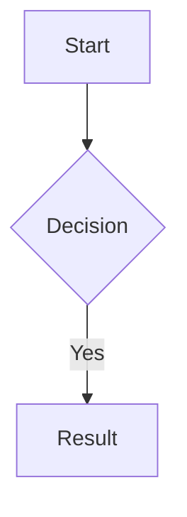

# NotesApp — Product Specification

## 1. Overview

A desktop note-taking application, designed for **AI-assisted research and learning**. The user augments AI-generated content with notes and reference material obtained elsewhere (PDFs, markdown, and other documents). The application supports arbitrary text file authoring and, for rich markdown documents (with LaTeX equations and Mermaid diagrams), real-time WYSIWYG editing and drawing tools.  The application also provides a reference document library (with built in rendering for PDF and markdown documents), and independent chat panels connected to an AI backend (initially Claude).

All data — notes, reference documents, and AI conversation context — is stored in a **project data directory** on the local filesystem, independent of the application installation. No cloud sync is required or assumed.  The user may elect to use `git` to manage persistence and revision control of the project files, but that is beyond the scope of this application.

The application UI is a **native desktop window** powered by an embedded webview (Tauri). It is not accessed through a web browser, except for debugging and integration tests.

A secondary purpose of this project is as a testbed for learning about and evaluating the use of Claude Code in order to develop a project such as this.  The end result is absolutely to be an application that can be installed on a target system, but along the way, it is anticipated that much will be learned about the use of Claude Code in specifying and developing an application such as this.

### 1.1 Terminology

This specification uses the following terms consistently:

- **Tile** — a rectangular region in the window's tiling layout. Tiles are the leaves of the layout's binary tree (see §4.0). Splitting, closing, maximizing, focusing, and pinning are all operations on tiles.
- **Tile mode** (or **tile type**) — one of `Editor`, `Preview`, `Reference`, `AI Chat`, or `Missing`. Every tile has exactly one mode at any given time. The first four are user-selectable; `Missing` is a recovery mode entered automatically when a tile's bound buffer cannot be resolved (see §5.5).
- **Buffer** — within a given tile mode, the specific file or session the tile is currently bound to (a markdown note for Editor and Preview tiles, a reference document for Reference tiles, an AI session for AI Chat tiles). **Every tile is bound to a buffer at all times.** The application never produces an unbound tile through any user action; see §4.0.1 for how this invariant is maintained. The sole exception is `Missing` mode, which represents a broken binding rather than an unbound tile.

The term *pane* is avoided in this specification; all references are to *tiles*.

### 1.2 Relationship to ROADMAP.md

This specification describes the required behavior of the finished application. It does not prescribe the order in which features are implemented or which subset is delivered in early releases. Those concerns — along with per-phase deliverables, entry and exit criteria, and any simplifying substitutions for incomplete features — are defined in `ROADMAP.md`. When `ROADMAP.md` and `SPEC.md` appear to conflict, `SPEC.md` describes the end state; `ROADMAP.md` describes the path there. Where `ROADMAP.md` specifies a temporary substitute for a spec'd behavior in an intermediate phase, that substitution is explicit in `ROADMAP.md`.

---

## 2. Application Architecture

### 2.1 Target Platform

- **Target platform:** M1 chipset based macOS (primary), with Linux/Windows portability desirable
- **Framework:** [Tauri v2](https://tauri.app/) (Rust backend + web frontend) — **confirmed, not revisitable**
  - Lighter than Electron; native OS integration; strong file-system access via Rust
  - The webview is embedded in a native window — users never navigate to a URL in their browser

> **Webview compatibility note:** Development occurs on x86 Ubuntu 24.04 (WebKitGTK webview).
> Production target is macOS Apple Silicon (WKWebView). These webviews are close but not
> identical. Known risk areas: canvas rendering (Excalidraw), font antialiasing, CSS
> `backdrop-filter`. Any divergence discovered during development must be documented in
> `COMPAT.md` at the repository root.

#### 2.1.1 Development Platform

The primary development platform for this application is an x86 Ubuntu 24.04 LTS Linux VM with Claude Code, Google Chrome, and the "Claude in Chrome" extension installed. Claude Code performs most of the development, debugging, and integration testing in that environment. Chrome / Claude in Chrome are available for visual debugging, but all automated tests must run without human observation, using `Xvfb` for headless display.

### 2.2 Frontend Stack

| Concern | Library |
|---|---|
| UI framework | React 18 (with TypeScript, strict mode) |
| Layout / tile splitting | [react-mosaic](https://github.com/nomcopter/react-mosaic) — arbitrary tiling layout (see §4) |
| Markdown editor | [CodeMirror 6](https://codemirror.net/) with markdown language support |
| Markdown rendering | [unified](https://unifiedjs.com/) / remark / rehype pipeline |
| LaTeX rendering | [KaTeX](https://katex.org/) (fast, offline) |
| Diagram rendering | [Mermaid.js](https://mermaid.js.org/) |
| WYSIWYG rich-text editing | [Tiptap](https://tiptap.dev/) (ProseMirror-based; supports markdown, bold/italic/lists) |
| Shared document model (CRDT) | [Yjs](https://yjs.dev/) with `y-codemirror.next` and `y-prosemirror` bindings |
| Drawing / annotation | [Excalidraw](https://excalidraw.com/) embedded as a React component |
| PDF rendering | [PDF.js](https://mozilla.github.io/pdf.js/) |
| State management | Zustand |
| Styling | Tailwind CSS + CSS custom properties for theming |
| Build tool | Vite |

### 2.3 Backend (Rust / Tauri)

- File I/O: read/write notes, references, attachments, AI context files
- **File watcher:** the Rust backend watches the project directory (`notes/`, `references/`, `.notesapp/ai-context/`) for external changes and notifies the frontend when files bound to open tiles are deleted, renamed, or replaced. This enables the mid-session `Missing` mode transition described in §5.5. Implementation: the `notify` crate with debounced events.
- AI proxy: forward requests to Claude API (or other backends); manage API keys from local config; stream responses back to frontend
- **Project-wide search and retrieval:** full-text search over all notes and reference documents in the project, exposed as a tool that the AI backend can call (see §7.2)
- PDF text extraction for indexing (using `pdf-extract` or `pdfium`)
- Search engine: [Tantivy](https://github.com/quickwit-oss/tantivy) embedded in Rust for fast local full-text search

---

## 3. Data Model and Storage

### 3.1 Directory Layout

The application is launched with a project directory as its working context. The project directory *is* the project — there is no separate "data root" containing multiple projects. Each running instance of the application owns exactly one directory.

```
<project-dir>/                     # the directory the application was launched in
  .notesapp/                       # app state — can be .gitignored if desired
    project.toml                   # project metadata (name, description, active AI backend)
    layout.json                    # last window layout (mosaic tree + tile mode + buffer bindings)
    search-index/                  # Tantivy full-text index (regenerated on demand)
    ai-context/
      <session-id>.json            # full conversation history per AI session
      system-prompt.md             # optional per-project system prompt for AI
  notes/
    <filename>.md                  # markdown notes — named by the user
    <filename>.NNNN.drawing        # sidecar Excalidraw JSON, zero or more per note
    <filename>.<ext>               # arbitrary text file notes, not rendered in WYSIWYG Preview tile
  references/
    <filename>.pdf                 # reference PDFs
    <filename>.md                  # reference markdown documents
    <filename>.pdf.annotations     # sidecar JSON for PDF annotations
  attachments/
    <filename>                     # images and data files embedded in notes

~/.config/notesapp/config.toml    # global config: API keys, theme, font, recent projects
```

**Launching:** The app reads the `NOTESAPP_PROJECT_DIR` environment variable if set; otherwise it presents a directory-chooser dialog. The full resolution logic — including how the app handles a non-existent leaf, a malformed project, or an inaccessible path — is specified in §6.1.1. On macOS, the app bundle can also be invoked via Finder or the terminal with a path argument.

**Notes on git compatibility:** The `notes/` and `references/` directories contain only plain text or binary files with no proprietary lock-in. The user may elect to manage these in a git repository. The `ai-context/` directory contains JSON files that are also git-friendly, giving a recoverable history of AI conversations.

### 3.2 Note Format

Each `.md` file is standard CommonMark with YAML front-matter:

````markdown
---
title: "My Note"
created: 2026-03-27T10:00:00Z
modified: 2026-03-27T12:00:00Z
tags: [physics, draft]
---

# My Note

Inline LaTeX: $E = mc^2$

Display LaTeX:
$$
\int_0^\infty e^{-x^2} dx = \frac{\sqrt{\pi}}{2}
$$



A drawing block (between paragraphs):

```drawing
my-diagram.NNNN.drawing
```
````

The YAML front-matter block is metadata, not content. It is parsed by both the Rust backend (for sidebar sorting by `modified`, full-text search field weighting, and the AI `list_notes()` tool's title/tag projection) and the frontend rendering pipeline. In an Editor tile the front-matter is shown verbatim and is fully editable as part of the note's source. In a Preview tile the front-matter is parsed for metadata and **hidden from the rendered output** — it is not rendered as text, as a thematic break, or as any other visible element. This visibility rule applies from the first phase that ships a Preview tile (see `ROADMAP.md`).

### 3.3 AI Context Format

Conversation history stored as JSON (Claude Messages API format) per session, scoped to a project. Includes:
- Full message history (user + assistant turns)
- Model identifier
- System prompt reference
- Timestamp of last interaction
- Human-readable session name (stored inside the JSON, not in the filename)

Session IDs are UUID v4 values generated by the application — not provided by the AI backend.

---

## 4. UI Layout

### 4.0 Tiling Layout Engine

The main window uses **[react-mosaic](https://github.com/nomcopter/react-mosaic)** to provide a fully flexible tiling layout. The layout is modeled as a binary tree:

- Each **leaf node** is a **tile** (see §1.1)
- Each **internal node** is a split — either horizontal (side by side) or vertical (stacked)
- Any tile can be split further into two via a UI widget or using a keyboard shortcut

This means there is no hardcoded grid. The default layout on first launch is a suggestion; the user can rearrange freely. Example alternative layouts:

```
Default (3-column + bottom AI bar):

  [ Editor ] [ Preview ] [ Reference ]
  [       AI Chat (full width)       ]

2×2 research layout:

  [ AI Session 1 ] [ Editor         ]
  [ AI Session 2 ] [ Preview / Note ]

Reference-heavy layout:

  [ Editor ] [ Reference (PDF) ] [ Reference (PDF) ]
  [ Preview                    ] [ AI Chat         ]
```

Each tile has a title bar showing its mode and its currently bound buffer. The title bar has:
- A **mode indicator** (see §4.0.1) — shows the tile's current mode. On `Editor` and `Preview` tiles it also serves as a one-click toggle between those two modes (subject to the markdown-only restriction described in §4.0.1).
- A **buffer name** showing the currently bound file or session, with a **▾ dropdown button** that opens the tile's buffer picker (see §4.0.2)
- A **close** button (removes the tile; its buffer content is not deleted)
- A **split horizontal / split vertical** button to divide the tile in two (see §4.0.3)
- A **maximize** button to temporarily expand the tile to full window (click again to restore)
- A **pin/star icon** (Editor tiles only) — see §4.4

**User-selectable tile modes:**
- `Editor` — raw markdown text editor
- `Preview` — WYSIWYG rendered view/editor of a specific markdown note
- `Reference` — PDF or markdown reference document viewer
- `AI Chat` — an AI chat session

**Automatic recovery mode** (not user-selectable):
- `Missing` — a tile whose bound buffer cannot be resolved; see §5.5

Multiple tiles of the same mode can be open simultaneously. This includes multiple Editor or Preview tiles bound to the **same note** — analogous to Emacs split windows on the same buffer. Because all Editor and Preview tiles bound to the same note share a single Yjs document (see §5.2), edits in any such tile immediately appear in all others.

**One project per application instance.** Launch additional instances for additional projects.

**Layout persistence:** `.notesapp/layout.json` is written immediately whenever the user makes a structural layout change (splitting a tile, closing a tile, moving a tile, changing a tile's mode, changing a tile's bound buffer, or resizing a split boundary). Maximize/unmaximize is a transient view state and does not trigger a save. On next open, the layout is restored exactly: each tile's mode and bound buffer are restored. If a file referenced by a tile has been renamed or deleted outside the application, that tile opens in `Missing` mode (see §5.5).

**Scroll position persistence:** on clean exit (normal quit, not crash), the scroll position of each tile is written into `layout.json` alongside the layout tree. On restore, each tile is scrolled to its saved position after the content loads. Scroll positions are not saved on crash — the tile reopens at the last saved position.

#### 4.0.1 Tile Mode Selection and the "Always Bound" Invariant

**Invariant:** every tile has both a mode and a bound buffer at all times. The application never produces an unbound tile through any user action. The only mode in which a tile has no resolved buffer is `Missing`, which itself describes a broken binding — see §5.5.

The mechanisms that uphold this invariant:

**Initial mode and binding at tile creation.** Tiles created by the first-launch or new-project wizard are bound to the first note the wizard collects from the user (see §6.1). The default layout creates one Editor tile and one Preview tile, both bound to that first note.

Tiles created by splitting an existing tile (`C-x h` or `C-x v`, or the title-bar split buttons) **inherit the parent tile's mode and currently bound buffer**. This matches Emacs `C-x 2` / `C-x 3` semantics: the split shows the same content in both halves. After the split, either half can be rebound to a different buffer via `C-x b` or retargeted to a different mode via `C-x n *` (see §4.1). Splitting a `Missing` tile produces two `Missing` tiles sharing the same broken binding — the user can then resolve each independently.

**Changing the mode of an existing tile in place.** Four keyboard shortcuts change the current tile's mode. Each immediately opens the mode-appropriate buffer picker (see §4.0.2) so the user selects a buffer to bind:

| Shortcut | Action |
|---|---|
| `C-x n n` | Set current tile mode to **Editor** and open a note |
| `C-x n p` | Set current tile mode to **Preview** and open a note |
| `C-x n r` | Set current tile mode to **Reference** and open a reference document |
| `C-x n c` | Set current tile mode to **AI Chat** and open (or create) a session |

These shortcuts never open new tiles — they always operate on the currently focused tile. To create a new tile, split first (`C-x h` / `C-x v`) and then change the mode of one of the resulting halves.

**Preview mode applies to markdown files only.** If the currently focused tile is in `Editor` mode and its bound buffer is a non-markdown text file (extension other than `.md`), `C-x n p` is a no-op with a brief status-bar message ("Preview is only available for markdown files"). The title-bar toggle described below is disabled in the same situation. All other `C-x n *` shortcuts are always available regardless of the bound buffer's file type.

**Title-bar mode toggle (Editor ↔ Preview only).** On `Editor` and `Preview` tiles, the mode indicator in the title bar is a clickable toggle that switches the tile between `Editor` and `Preview` mode while keeping the currently bound note. This is a convenience for the common case of viewing and editing the same markdown file. The toggle is **disabled (greyed out) when the currently bound file is not a markdown file** (i.e., its extension is not `.md`); a non-markdown file cannot be previewed, so the Preview mode is unavailable for it.

The title-bar indicator on `Reference` and `AI Chat` tiles is a plain label, not a toggle — the title bar does not offer mode switching on those tiles. `Missing` tiles also do not offer mode switching via the title bar; their actions are fixed and described in §5.5.

The full set of mode transitions (including Editor/Preview → Reference or AI Chat, and Reference/AI Chat → anything else) remains available through the `C-x n *` keyboard shortcuts listed above. The title-bar toggle is intentionally narrower than the keyboard shortcuts because switching between an Editor and an AI Chat tile — or any other cross-category switch — is a rare, deliberate operation that should require a deliberate keystroke.

**Canceling a mode-switch picker.** If the user dismisses the picker with `Escape` (or clicks outside it) before selecting a buffer, the mode change is rolled back: the tile reverts to its prior mode and prior bound buffer. Nothing is left unbound as a result of a cancellation.

**Releasing a previously bound buffer.** When a tile's mode or bound buffer changes, the previously bound buffer is released from that tile's perspective. The buffer itself is not closed project-wide — any other tile bound to it is unaffected, and the buffer's Y.Doc (for notes) or in-memory session (for AI Chat) is retained as long as at least one tile is still bound to it.

**Last-tile release of a modified buffer.** If the tile being released (via mode change, buffer switch, tile close, or window/app quit) is the *last* tile bound to a buffer that has unsaved changes, the application must prompt the user before proceeding:

> "`<filename>` has unsaved changes. Save before closing?"
> `[ Save ]` `[ Discard ]` `[ Cancel ]`

- **Save** writes the buffer to its `.md` file (the same operation as `C-x C-s`), deletes the corresponding `.tmp` file if present, and then proceeds with the release.
- **Discard** deletes the `.tmp` file (if present) and proceeds with the release; any unsaved edits are lost.
- **Cancel** aborts the release entirely — the mode change, buffer switch, or tile close does not happen, and the tile remains bound to the buffer.

This prompt applies to every last-tile release that would otherwise lose unsaved work. The sole exceptions are:

- The buffer backs a `Missing` tile whose file has been deleted externally: see §5.5 for that case, which uses a simpler Continue/Cancel confirmation since saving is not meaningful when the underlying file is gone.
- The user is quitting the application with multiple modified buffers open: the application shows a *consolidated* dialog listing every modified buffer with a per-buffer checkbox for Save vs. Discard, plus a single `Cancel` button that aborts the quit. This avoids forcing the user through five separate dialogs on app quit.

If a buffer is bound to more than one tile, releasing one tile does not trigger the prompt — the buffer is still held by the other tile(s) and no data is at risk. Only the *last* release triggers it.

#### 4.0.2 Tile Buffer Pickers

Every `Editor`, `Preview`, `Reference`, or `AI Chat` tile has an associated **buffer picker** — a fuzzy file/session picker — used to select what the tile displays. The picker is invoked by:

- Opening the tile's title-bar `▾` dropdown
- Pressing `C-x b` when the tile is focused (see §4.2 for the modal behavior)
- Pressing `C-x n *` to change the tile's mode (see §4.0.1)

The picker opens as a floating dialog over the window with a live-filtered text input at the top and a keyboard-navigable results list below. The first item in the filtered list is highlighted by default, so `Enter` immediately accepts the top match. `Escape` cancels.

**Contents of the picker depend on the tile's mode:**

| Tile mode | Picker contents |
|---|---|
| `Editor` | All files in `notes/` (any text file — not restricted by extension), plus a `+ New note…` option at the top |
| `Preview` | Only `.md` files in `notes/`, plus a `+ New note…` option at the top |
| `Reference` | All files in `references/` (no "new" option — references are imported via drag-and-drop, not created in-app; see §5.3) |
| `AI Chat` | All existing AI sessions (listed by human-readable name), plus a `+ New chat…` option at the top |

Selecting `+ New note…` in an Editor or Preview picker prompts the user for a filename and creates an empty note on disk, then binds the tile to it. In an Editor picker, the user may enter any filename — if no extension is given, `.md` is added automatically (per §6.2); if a non-`.md` extension is given, the file is created with that extension verbatim and the tile opens it as a plain text file. In a Preview picker, the `.md` extension is added automatically when no extension is given, and entering a non-`.md` extension is rejected with an inline message ("Preview mode requires a markdown file; please use a `.md` extension or create this file from an Editor tile instead"). Selecting `+ New chat…` in an AI Chat picker prompts for a human-readable session name, creates a new session with a fresh UUID v4 and empty history (per §5.4), and binds the tile to it.

Selecting an existing item binds the current tile to that buffer, replacing whatever was previously displayed in this tile. Other tiles bound to the previous buffer are unaffected.

#### 4.0.3 Tile Splitting

`C-x h`, `C-x v`, and the title-bar split buttons divide the focused tile into two tiles along the chosen axis. As noted in §4.0.1, both resulting tiles inherit the mode and bound buffer of the original. The originally focused half retains focus; the newly created half is initially unfocused. Either half may subsequently be rebound or mode-switched without affecting the other.

### 4.1 Tile and Layout Keyboard Shortcuts

All tile operations are available via keyboard. Suggested default bindings (user-configurable):

The application provides a configuration item for selecting current state-of-the-art common usage key bindings as well as Emacs key bindings.  Where a feature is specific to this application and the Emacs binding listed below does not compete with the common usage binding, the Emacs binding is selected by default.  The user has the option of selecting Emacs key bindings or common usage bindings.

| Action | Emacs Style Keybinding |
|---|---|
| Focus next tile (cycle) | `C-x o` |
| Focus previous tile | `C-x O` |
| Split current tile horizontally | `C-x h` |
| Split current tile vertically | `C-x v` |
| Close current tile | `C-x 0` or `C-x w` |
| Maximize / restore current tile | `C-x z` |
| Switch buffer in focused tile (modal by tile mode) | `C-x b` |
| Set current tile mode to Editor and open a note | `C-x n n` |
| Set current tile mode to Preview and open a note | `C-x n p` |
| Set current tile mode to Reference and open a reference | `C-x n r` |
| Set current tile mode to AI Chat and open (or create) a session | `C-x n c` |
| Save current note | `C-x C-s` |
| Open note by name (focused Editor tile) | `C-x C-f` |
| Open reference by name (focused Reference tile) | `C-x C-r` |
| Toggle pin on current Editor tile | `C-x p` |
| Toggle activity sidebar | `Cmd+B` (`Ctrl+Shift+B` on Windows/Linux) |
| Global project search | `Ctrl/Cmd+Shift+F` |
| Focus tile `N` (1–9) | `C-x N` |
| Increase rendered font size in text and markup tiles; increase zoom in PDF tiles | `Ctrl/Cmd+=` |
| Decrease rendered font size in text and markup tiles; decrease zoom in PDF tiles | `Ctrl/Cmd+-` |
| Reset font size (focused tile) | `Ctrl/Cmd+0` |
| Cursor movement matches Emacs bindings (Editor and WYSIWYG Preview tiles) | `C-a`, `C-e`, `C-b`, `C-f`, `C-p`, `C-n`, `M-<`, `M->`, etc. — see §5.1 for the full list; applies in both Editor tiles (CodeMirror) and the WYSIWYG editor of Preview tiles (Tiptap) |
| Emacs style Incremental and Regexp incremental search support and key bindings | `C-s`, `C-r`, `M-C-s`, `M-C-r`, `C-w` (while searching) |
| Emacs style Query Replace and Query Replace regexp | `M-%`, `M-C-%` |
| Move cursor to next visible Markdown header in Editor tile | `C-c` `C-n` |
| Move cursor to previous visible Markdown header in Editor tile | `C-c` `C-p` |
| Emacs style use of ESC as an alternative to the META key ||


The `C-x` prefix family is intentionally consistent with Emacs window/buffer commands.  In the MacOS version, `Cmd+` shortcuts follow macOS conventions and are available even when focus is outside the editor.

The Emacs movement, kill/yank, mark, and undo bindings listed in §5.1 apply uniformly in the Editor tile (CodeMirror) and the WYSIWYG editor of the Preview tile (Tiptap). The TAB-disambiguation rules defined in §5.1 (heading fold, table cell advance, code-block tab, indent) are **specific to the Editor tile** — in the WYSIWYG editor TAB has its native ProseMirror meaning (advance to next list/table position).

The application provides current state-of-the art common usage top level menu bar items, for example for file open, file close, project open, project close, copy, paste, select all, search, etc...

**Tile numbering for `C-x N`:** tiles are numbered 1–9 in reading order (left to right, top to bottom) based on the current layout. A small number badge is shown in each tile's title bar while the `C-x` prefix is active (i.e. between pressing `C-x` and completing the chord), so the user can see which number corresponds to which tile before pressing the digit. The badge disappears as soon as the chord completes or is cancelled.

### 4.2 Activity Sidebar

A collapsible sidebar on the left edge of the window (toggled with `Ctrl/Cmd+B`). It contains the following sections, each of which is collapsible:

**Explorer** — notes file list:
- Flat list of all notes in the project, sorted by modification time (or alphabetically; user-configurable)
- Browse only — clicking a note does not open it
- To load a file into a tile: use `C-x b` (buffer switcher) or drag a file from the sidebar onto any tile

**Search** — full-text search across all notes and references (§5.5). Results are grouped by file with surrounding context lines.

**Tags** — browse notes by front-matter tag.

**References** — flat list of all files in `references/`.

The sidebar remembers which sections are open or closed, per project.

**Buffer switcher (`C-x b`) — modal by tile mode:** pressing `C-x b` opens the buffer picker for the currently focused tile, as defined in §4.0.2. The picker's contents depend on the focused tile's mode:

- In an Editor tile: lists notes from `notes/` with a `+ New note…` option
- In a Preview tile: lists notes from `notes/` with a `+ New note…` option
- In a Reference tile: lists files from `references/` (no "new" option)
- In an AI Chat tile: lists existing AI sessions with a `+ New chat…` option

When invoked in a `Missing` tile, `C-x b` opens the Editor picker (regardless of what mode the tile was in before the binding broke); selecting a note from that picker rebinds the tile as an Editor tile bound to that note. See §5.5.

Arrow keys navigate the list; `Enter` binds the selected item to the focused tile (replacing its current buffer); `Escape` cancels. If no tile is focused, `C-x b` is a no-op.

### 4.3 Visual Theme and Fonts

**Colors:** The default color scheme is modeled on the **Claude web client**: warm, earthy tones centered on a coral/orange-red, complemented by neutral backgrounds. This theme is applied from the very first build — it is not deferred.

**Key color tokens (defined in `src/styles/tokens.css`):**

```css
:root {
  --color-accent:        #CC785C;   /* coral/terracotta — primary CTA, highlights */
  --color-accent-hover:  #B8674D;
  --color-accent-muted:  #E8C4B0;

  --color-bg-primary:    #F5F0EB;   /* main window background */
  --color-bg-secondary:  #EDE8E2;   /* sidebar, secondary surfaces */
  --color-bg-overlay:    #FFFFFF;   /* cards, popovers */

  --color-surface-dark:  #1A1A1A;   /* dark mode base, title bars */
  --color-surface-mid:   #2C2C2C;

  --color-text-primary:  #1C1917;
  --color-text-secondary:#6B6560;
  --color-text-disabled: #A8A29E;

  --color-border:        #D9D3CC;
  --color-border-focus:  #CC785C;
}
```

All component files reference these CSS variables — hex values are never hardcoded in component files.

Overall aesthetic: Warm, minimal, and human-feeling — deliberately avoiding the cold blues common in tech/AI products.

Dark mode and system-adaptive mode are available via `config.toml`.

**Fonts — bundled, not system-dependent:**

Both fonts are bundled in `public/fonts/` and loaded via `@font-face`. System font fallbacks are a last resort, not the primary strategy.

- **Editor tile:** [JetBrains Mono](https://www.jetbrains.com/lp/mono/) — `--font-editor`
- **Preview / rendered content / AI chat:** [Inter](https://rsms.me/inter/) — `--font-prose`
- **Font sizes:** `Ctrl/Cmd+=` / `Ctrl/Cmd+-` / `Ctrl/Cmd+0` adjust the font size of the **currently focused tile** only. Each tile independently tracks its current font size, starting from the project defaults defined in `project.toml`. Per-tile size adjustments are not persisted across sessions.

### 4.4 Primary Note and the Pin Mechanism

When the user clicks "Insert into note" in an AI Chat tile, the content is inserted into the **primary note** — a single designated Editor tile.

**Rules:**
- The primary note is the Editor tile that is currently **pinned**.
- The user pins a tile by pressing `C-x p` when that tile is focused, or by clicking the pin icon (📌) in the tile's title bar.
- The pin icon is displayed only on Editor tiles (not Preview, Reference, AI Chat, or Missing tiles).
- Only one Editor tile can be pinned at a time; pinning a new tile automatically unpins the previously pinned tile.
- Pin state is **transient** — it is not persisted to `layout.json` or restored across sessions.
- If a tile is switched to Editor mode via `C-x n n` (or the title-bar dropdown) while another tile is pinned, the pin state is unchanged: the pinned tile remains pinned, and the newly-switched tile is unpinned by default.
- If the pinned Editor tile's underlying note becomes unresolvable mid-session (the file is deleted or renamed externally), the tile enters `Missing` mode (§5.5) and the pin is discarded at that moment — the pin icon is Editor-only, so a `Missing` tile cannot display or retain a pin.

**"Insert into note" target resolution:**

When the user clicks "Insert into note" in an AI Chat tile:

1. **If a pinned Editor tile exists** and it is currently in `Editor` mode (not `Missing`), the content is appended to that tile's bound note with no prompt.
2. **Otherwise** (no tile is pinned, or no such tile is in Editor mode), a **target picker** opens: a fuzzy picker listing every `Editor` tile currently open in the window, showing each tile's bound note filename and its tile number (1–9) for reference. The first item in the list (the Editor tile lowest-numbered in reading order) is highlighted by default, so `Enter` immediately accepts it.
   - Selecting a tile appends the content to that tile's bound note. The selection does *not* pin the tile — the pin remains explicit, set only via `C-x p` or the pin icon.
   - If no Editor tiles are open, the picker shows a single `+ New note…` option that creates a new note (prompting for the filename) and a new Editor tile bound to it, placed in the layout by splitting the largest existing tile.
   - `Escape` cancels the insert.

This design keeps the destination of every "Insert into note" operation visible and confirmed: either the user has explicitly pinned a tile (one-click/no-prompt insert) or they confirm the destination at insert time. The application does not maintain any "most recently focused Editor tile" state for this purpose.

---

## 5. Tile Mode Specifications

### 5.1 Editor Tile (Source)

**Purpose:** Raw markdown authoring with a rich Emacs-like editing experience.

**Buffer binding:** An Editor tile is bound to exactly one `.md` file in `notes/`. The bound file is shown in the tile title bar with a `▾` dropdown (see §4.0.2) that opens the buffer picker. Multiple Editor tiles may be bound to the same note; they share a single Y.Doc (see §5.2) so edits in one tile immediately appear in all others.

**Core features:**
- Syntax highlighting for Markdown, LaTeX (`$...$` / `$$...$$`), and Mermaid fenced code blocks
- Line numbers, word wrap toggle
- Auto-closing brackets and delimiters are **NOT** supported, but highlighting matching braces is supported
- Toolbar shortcuts for common markdown constructs (bold, italic, heading, link, image, table, code block, LaTeX block, Mermaid block)
- Find/replace with regex support
- Live word and character count
- Scroll-sync with Preview tile (cursor position in editor highlights corresponding position in preview)
- Dirty indicator (`•`) in the tile title bar when there are unsaved changes. The dirty state is determined by comparing the current Y.Doc content to the content of the last explicit save (i.e. the `.md` file on disk). If the user undoes all changes back to the saved state, the dirty indicator must be cleared automatically and any in-progress `.tmp` file for that note must be deleted. This mirrors the behavior of Emacs (undo-to-clean clears the modified flag) and VS Code.

**Emacs keybindings (required, not optional):**

The editor must implement Emacs keybindings via CodeMirror 6's `@codemirror/lang-markdown` and `@replit/codemirror-emacs` (or equivalent). The following Emacs behaviors are specifically required:

- **Standard motion and editing:** `C-f/b/n/p`, `M-f/b`, `C-a/e`, `C-k` (kill to end of line), `C-y` (yank), `M-y` (yank-pop from kill ring), `C-space` (set mark), `C-w` (kill region), `M-w` (copy region), `C-x C-s` (save), `C-x C-f` (open file), `C-/` or `C-_` (undo), `C-g` (cancel), `M-<` (beginning of file, also `Esc`, `<`), `M->` (end of file, also `Esc`, `>`)
- **Keyboard macros:** `C-x (` to start recording, `C-x )` to stop, `C-x e` to execute most recent macro, `C-u N C-x e` to execute N times
- **Rectangle operations:** `C-x r k` (kill rectangle), `C-x r y` (yank rectangle), `C-x r t` (string-replace rectangle), `C-x r o` (open rectangle / insert spaces). These are essential for manipulating columns of ASCII text.
- **Org-mode table editing:** When the cursor is inside a markdown table, `TAB` advances to the next cell (creating a new row at end of table), `S-TAB` moves to the previous cell, `M-RET` inserts a new row, `M-left/right` moves columns, `M-up/down` moves rows. The table is automatically reformatted (column widths aligned) on each `TAB`.
- **Section folding (Org-mode style):** Pressing `TAB` on a markdown heading line cycles through three states for that section: **FOLDED** (only the heading is visible), **CHILDREN** (heading + immediate child headings), **SUBTREE** (fully expanded). `S-TAB` cycles the entire document between all-folded and all-expanded. A small indicator (▶/▼) on each heading line shows fold state.

**TAB key disambiguation — priority rules (evaluated in order):**

1. **Cursor is on a heading line** (the line begins with one or more `#` characters): TAB cycles the fold state of that heading's section. No text is inserted.
2. **Cursor is inside a table** (any line of the table, including the separator row): TAB advances to the next cell, reformats the table, and creates a new row if needed. No text is inserted.
3. **Cursor is in a fenced code block** (between ` ``` ` fences): TAB inserts a literal tab character (standard code indentation behavior).
4. **All other contexts:** TAB inserts spaces to indent the current line to the next stop, matching the indentation level of the previous non-blank line. Default indent width: 4 spaces (configurable).

**Spellcheck and writing assistance:**
- Spellcheck is enabled by default in the editor (red wavy underlines on misspelled words). The check runs in-process in Rust — `NSSpellChecker` on macOS, `spellbook` (Hunspell-compatible, pure Rust) on Linux backed by the system's `hunspell-en-us` dictionary — and underlines are rendered as CodeMirror decorations. This deviates from the original "use the webview native checker" intent because WKWebView's native checker fires only on keyboard input events, not on the programmatic content load that yCollab performs for every document open. Right-click "Suggestions" menu is deferred (see ISSUES.md).
- Optionally, [LanguageTool](https://languagetool.org/) can be run as a local background process (no cloud) for grammar and style suggestions beyond spelling. Enabled in `config.toml`; the app checks at startup whether `languagetool-server` is available on `$PATH`.
- Spellcheck is suppressed inside fenced code blocks, LaTeX blocks, and Mermaid blocks.

### 5.2 Preview Tile (Rendered)

**Purpose:** Real-time rendered output with seamlessly bidirectional WYSIWYG editing.

**Buffer binding:** A Preview tile is bound to exactly one `.md` file in `notes/`. The bound file is shown in the tile title bar with a `▾` dropdown (see §4.0.2) that opens the buffer picker. The Preview tile's bound note is **independent** of any Editor tile — it does not "follow" the focused Editor. Multiple Preview tiles may be bound to the same note, and an Editor and a Preview tile may both be bound to the same note; in all such cases they share a single Y.Doc (see below) so edits in any tile immediately appear in all others.

**Rendering pipeline:**
- Markdown → HTML (remark/rehype)
- YAML front-matter (the `---`-delimited block at the top of the note, per §3.2) is parsed for metadata via `remark-frontmatter` and **stripped from the rendered output** — it must not appear in the Preview tile as text, as a thematic break, or as any other visible element
- LaTeX → rendered math (KaTeX, both inline and display)
- Mermaid code blocks → rendered diagrams (Mermaid.js)
- Updates on each keystroke in any tile bound to the same note (debounced ~150ms)
- Editor and Preview tiles bound to the same note are scroll-synced when both are visible

**WYSIWYG editing (Tiptap layer) — seamlessly bidirectional via Yjs CRDT:**

Each open note is backed by a single **[Yjs](https://yjs.dev/) CRDT document** held in memory. Multiple Editor or Preview tiles bound to the same note all share this document, so edits in any tile immediately appear in all others with no polling or round-trip serialization. A note's Y.Doc is created when the first tile binds to it and released when the last tile unbinds.

The two editors bind to the Yjs document differently and require a translation layer:
- **CodeMirror 6** (Editor tile) binds via `y-codemirror.next` to a `Y.Text` — a flat string representation (markdown source)
- **Tiptap/ProseMirror** (Preview tile) binds via `y-prosemirror` to a `Y.XmlFragment` — a rich node tree

These are different Yjs types and cannot be shared directly. The implementation must maintain a **bridge** that translates between them: markdown text ↔ ProseMirror node tree, applied as incremental CRDT updates rather than full re-parses. The recommended approach is to treat `Y.Text` (markdown) as the single source of truth and derive the `Y.XmlFragment` from it via the remark/rehype parse pipeline, applied on each Yjs text-change event. Edits originating in Tiptap are serialized back to markdown (via Tiptap's markdown serializer) and written into the `Y.Text`. This is architecturally equivalent to a debounced round-trip for Tiptap-originated edits, but retains CRDT semantics for CodeMirror-originated edits and for multi-tile sync.

The Yjs document is serialized to the `.tmp` markdown file on disk every 30s in accordance with §9.1.

- Formatting toolbar: bold, italic, underline, strikethrough, inline code, heading levels (H1–H4), blockquote, ordered list, unordered list, task list (checkboxes), horizontal rule, link insert/edit
- Table editing: click into any cell to edit; toolbar buttons to add/remove rows and columns
- Clicking a rendered LaTeX equation does **not** open a popover — edit LaTeX in an Editor tile bound to the same note; the Preview re-renders instantly
- Clicking a Mermaid diagram navigates any Editor tile bound to the same note to the correct source line

Each Preview tile has its own explicit buffer binding per this section — the tile does not track any Editor's focus, and it does not auto-follow changes in any other tile.

**Pasting content from an AI Chat tile:**
- AI responses are rendered markdown. The user can select any portion of an AI response (including rich formatted content — headers, lists, code blocks, tables) and paste it into a Preview tile, preserving formatting via the Tiptap layer, which round-trips it to the note's Y.Text as clean markdown source.

**Emacs keybindings in the WYSIWYG editor:**

The WYSIWYG editor exposes the same Emacs movement and editing bindings as the Editor tile (§5.1): `C-f/b/n/p`, `C-a/e`, `M-f/b`, `M-<`/`M->` (also `Esc <`/`Esc >`), `C-k`, `C-y`, `C-space`, `C-w`, `M-w`, `C-/`/`C-_`, `C-g`, and the Esc-as-Meta prefix for `M-d` and `M-Backspace`. These are implemented as a ProseMirror keymap extension rather than via `@replit/codemirror-emacs` (which is CodeMirror-only); they translate to ProseMirror selection and transform commands. Line motion (`C-n`/`C-p`) uses the browser's `Selection.modify` API (available in WebKit/Chrome; verified by the E2E test suite).

Editor-tile-only Emacs features that do **not** apply in the WYSIWYG editor: the TAB heading-fold cycle, `S-TAB` document fold toggle, Org-mode table cell navigation (Tiptap has its own table commands), keyboard macros, rectangle operations, and incremental search. These remain Editor-tile features as specified in §5.1.

**Drawing blocks:**

Drawings are **block-level elements** in the document flow — they sit between paragraphs, not floating over text. This avoids all reflow and anchor problems. In the markdown source, a drawing block looks like:

````markdown
```drawing
my-diagram.drawing
```
````

In the Preview tile, this renders as an embedded Excalidraw canvas at that position in the document. The canvas has a fixed height (user-resizable by dragging its bottom edge).

- Double-click the rendered drawing to enter **edit mode**: the full Excalidraw toolbar appears (freehand pen, straight line, arrow, rectangle, ellipse, text label, eraser, color/stroke picker)
- Click outside or press `Escape` to exit edit mode; the canvas returns to a static rendered view
- The drawing content is stored in `notes/<filename>.NNNN.drawing` (where `NNNN` is a unique number within the `filename.md` file)
- Insert a new drawing block from the editor toolbar or via `C-c d` (keyboard shortcut); the app inserts the fenced block at cursor position
- **Export:** drawings are exported as embedded SVG or PNG in PDF/HTML/LaTeX output

**Export:**
- Export current note to: PDF, standalone HTML, LaTeX (`.tex`), plain markdown
- For LaTeX export: drawings are embedded as `\includegraphics` with accompanying SVG/PDF render; math pass-through; Mermaid diagrams exported as PDF/SVG figures
- Copy rendered HTML to clipboard

### 5.3 Reference Tile

**Purpose:** Browse, read, and extract content from project reference documents (PDFs and markdown files).

**Buffer binding:** A Reference tile is bound to exactly one file in `references/`. The bound file is shown in the tile title bar with a `▾` dropdown (see §4.0.2) that opens the Reference buffer picker.

**Features:**

**File selection:** The Reference tile title bar shows the name of the currently displayed file and a `▾` dropdown button. Activating the dropdown (mouse click, `C-x b` when the tile is focused, or `C-x C-r` as an explicit shortcut) opens a **fuzzy file picker** (same style as VS Code's `Cmd+P`): a text input with a live-filtered list of all files in `references/`, navigable by arrow keys, activated with `Enter`. Typing filters by filename. The picker is dismissed with `Escape`. Drag-and-drop a file from Finder into the tile also opens it directly.

The Reference picker does **not** include a "+ New" option — reference documents are imported into the project, not authored in-app.

- Drag-and-drop into the tile (or the activity sidebar References section) to import new files into `references/`
- **PDF viewer (PDF.js):** keyboard page navigation (`n`/`p` or `PageDown`/`PageUp`), zoom (`Cmd+=`/`Cmd+-`), thumbnail strip toggle, full-text search within the document (`Cmd+F`), text selection and copy
- **Markdown reference viewer:** rendered using the same remark/rehype/KaTeX/Mermaid pipeline as the Preview tile; read-only
- **Annotation:** select text in any reference → right-click context menu →
  - "Copy"
    - If pasted into an Editor or Preview tile, inserts the selected text as a blockquote with a citation footer
    - If pasted into an AI Chat tile, inserts the selected text as a user message in the active AI Chat session
  - "Highlight" — saves a highlight annotation to the sidecar file (`<filename>.pdf.annotations` for PDFs)
- PDF annotations (highlights, notes) are persisted in sidecar JSON files; the PDF files themselves are **never modified**
- Full-text search across all references in the project (powered by the Tantivy index in the Rust backend)

### 5.4 AI Chat Tile

**Purpose:** Conversational AI assistance with full awareness of project content.

**Buffer binding:** An AI Chat tile is bound to exactly one AI session (identified by UUID v4 stored in `ai-context/<session-id>.json`). The bound session's human-readable name is shown in the tile title bar with a `▾` dropdown (see §4.0.2) that opens the AI Chat buffer picker. Multiple AI Chat tiles may be bound to different sessions simultaneously; binding two tiles to the same session is allowed and both tiles reflect the same conversation history in real time.

**AI access to project content:**

The AI backend has tool-use access to the entire project. On each turn, the Rust backend makes the following tools available to the model:

| Tool | Description |
|---|---|
| `search_notes(query)` | Full-text search across all notes in the project; returns ranked excerpts |
| `read_note(slug)` | Returns the full content of a named note |
| `search_references(query)` | Full-text search across all reference documents (PDF text + markdown) |
| `read_reference(filename, page_range?)` | Returns extracted text from a reference document or page range |
| `list_notes()` | Lists all notes in the project with titles and tags |
| `list_references()` | Lists all reference files in the project |

This allows the AI to answer questions like "What did I write about X last week?" or "Is there anything in my references about Y?" without the user manually copying and pasting context.

**Chat interface:**
- Standard chat: user input at bottom, scrollable message history above
- Messages support full markdown rendering (including code blocks with syntax highlighting, LaTeX, and Mermaid diagrams)
- Streaming responses (tokens appear as they arrive)
- **Context controls (manual, in addition to tool use):**
  - "Include current note" toggle: prepends the contents of a chosen Editor or Preview tile's bound note to the next message
  - "Include selection" button: prepends highlighted text from an Editor, Preview, or Reference tile
  - "Include reference page" button: attach a selected page or passage from a Reference tile
  - Drag-and-drop file attachment (images, text files)

**Session management:**

AI sessions are exactly analogous to the separate chat threads in the Claude web UI: each has an independent conversation history and its own context window. Sessions are named by the user ("Chapter 3 questions", "Literature review", etc.) and stored as `ai-context/<session-id>.json`. The session ID is a UUID v4 generated by the application when the session is created — it is not provided by the AI backend. The human-readable session name is stored inside the JSON file, not in the filename. Multiple sessions can be open in separate tiles simultaneously.

- The tile title bar identifies the active session by name
- Create a new session (blank history) via `+ New chat…` in the AI Chat buffer picker; continue an existing one by selecting it from the picker
- All sessions persisted to disk; git-trackable
- View and edit raw context JSON (power user escape hatch)

**Context window management:**

Claude's context limit is currently 200,000 tokens (~150,000 words), which is large enough that most research sessions will never approach it. The application tracks usage and surfaces it clearly:

- A **context usage bar** in each AI Chat tile's header shows current token count as a percentage of the model's limit (e.g., `▓▓▓▓▓▓░░░░ 62% · 124k / 200k tokens`)
- At **75%**: a soft warning appears ("Context window is getting full")
- At **90%**: a prominent warning with two offered actions:
  - **Summarize and continue** — makes a second API call asking Claude to produce a concise summary of the conversation so far; that summary replaces the full history as a single assistant-prefaced context block; the original full history is preserved in the JSON file on disk and is not deleted
  - **Archive and start fresh** — saves the current session, creates a new session with no history (the user can manually paste in a summary if desired)
- The app **never silently truncates** context; any reduction is explicit and confirmed by the user
- Full history is always preserved in the JSON file on disk regardless of what is sent to the API

**Multiple AI Chat tiles:**
- Split buttons and keyboard shortcuts open a second AI Chat tile side-by-side (e.g., Claude Sonnet vs Opus, or two different sessions)

**Actions on AI responses:**
- **"Insert into note" button:** appends full response (as markdown) to the **primary note** as described in §4.4. If no Editor tile is pinned, a target picker opens for the user to select the destination Editor tile.
- "Copy markdown" button: copies raw markdown source
- "Copy formatted" button: copies rich text suitable for pasting into a Preview tile with formatting preserved
- Regenerate last response
- Edit a previous user message and re-run from that point

**Backend configuration (per project, in project.toml):**
- Backend: Claude (default), extensible (see §7.2)
- Model selector: `claude-opus-4-6`, `claude-sonnet-4-6`, `claude-haiku-4-5`, etc.
- System prompt: editable, stored in `ai-context/system-prompt.md`
- Max tokens, temperature

### 5.5 Missing Tile (Recovery Mode)

**Purpose:** A read-only recovery state displayed by any tile whose bound buffer cannot be resolved. `Missing` is not a user-selectable mode — the application enters it automatically. Its sole purpose is to give the user a visible, actionable surface for resolving a broken binding without losing work.

**When a tile enters `Missing` mode:**

1. **On project open (layout restore):** a tile's persisted binding in `layout.json` refers to a file that no longer exists in the expected location (`notes/`, `references/`, or `ai-context/`), or to an AI session JSON that fails to parse.
2. **Mid-session, via the file watcher (§2.3):** the file or session backing an open tile is deleted, renamed, or becomes unreadable while the application is running. When this happens, the affected tile transitions to `Missing` immediately; other tiles bound to the same buffer transition as well.
3. **Mid-session, via a failed read/write:** an operation on the bound buffer fails with a "file not found" or equivalent error that the file watcher has not yet surfaced.

**Appearance and behavior:**

- The tile displays a clear message, such as `⚠ File not found: notes/quantum.md` (or the corresponding reference filename or session name).
- The title bar shows the mode indicator as `⚠ Missing` and displays the missing buffer's name with no dropdown; mode switching and buffer switching are redirected to the actions below.
- The tile is **read-only**. No input is accepted; no autosave timer runs; no `.tmp` file is written from this tile. Any in-memory Y.Doc for a missing note continues to exist as long as at least one tile is bound to it, so unsaved edits are preserved and become writable again as soon as the binding is resolved (see "Locate…" below).
- The tile offers exactly three buttons:

| Action | Behavior |
|---|---|
| **Locate…** | Opens an OS filesystem picker scoped to the directory the missing file was recorded in (`notes/` if the broken binding refers to a file under `notes/`, `references/` if under `references/`, `ai-context/` if under `ai-context/`). The scope is derived from the broken binding itself, not from any "prior mode" state. If the user chooses a file, the tile rebinds to that path. For a note rebind, the tile enters `Editor` mode and any in-memory Y.Doc for the original path is attached to the new path and will be written there on next save. For a reference rebind, the tile enters `Reference` mode. For an AI session rebind, the tile enters `AI Chat` mode. |
| **Open a different buffer** | Opens the `Editor` buffer picker (see §4.0.2). Selecting a note rebinds the tile as an `Editor` tile bound to that note. If the Missing tile had unsaved changes in an in-memory Y.Doc for the missing file, a confirmation dialog appears first: "Unsaved changes for `<filename>` will be discarded. Continue?" (Continue/Cancel only — saving is not meaningful when the underlying file is gone; see §4.0.1 for the distinction from the normal last-tile-release prompt.) `Cancel` returns to the Missing tile without changes. |
| **Close tile** | Equivalent to `C-x 0` — removes the tile from the layout. If this was the last tile bound to a Y.Doc with unsaved changes, the same Continue/Cancel confirmation dialog as above appears first. |

**Keyboard shortcuts in Missing tiles:**

- `C-x b` opens the `Editor` buffer picker, equivalent to the "Open a different buffer" button.
- `C-x n *` mode-switch shortcuts work normally (they change the tile to the requested mode and open the corresponding picker, per §4.0.1). The mode-switch path does not carry the in-memory Y.Doc forward — if the user wants to recover unsaved edits into a different note, they should use "Locate…" and rebind to a different file.
- `C-x 0` / `C-x w` closes the tile, with the unsaved-changes confirmation as described above.
- `C-x z` (maximize) and tile numbering (`C-x N`) work normally.
- All other shortcuts are inactive.

**Persistence:** a `Missing` tile is serialized in `layout.json` with the (now-unresolvable) buffer path/ID. On next launch, if the buffer is resolvable again (the file was restored), the tile opens normally in the mode implied by the path's location (`notes/` → `Editor`, `references/` → `Reference`, `ai-context/` → `AI Chat`); if still unresolvable, it reopens as `Missing`.

**Splitting:** splitting a `Missing` tile (`C-x h` / `C-x v`) produces two `Missing` tiles sharing the same broken binding. The user can then resolve each independently.

**Relationship to the pin mechanism (§4.4):** if the pinned Editor tile enters `Missing` mode, the pin is discarded at that moment. The pin icon is not displayed on `Missing` tiles. Subsequent "Insert into note" operations will therefore fall through to the target picker described in §4.4.

---

## 6. Project Lifecycle

### 6.1 First Launch and Project Detection

At launch, the application must determine which project directory to open. The inputs to this decision are the `NOTESAPP_PROJECT_DIR` environment variable (if set) and, on macOS, a directory path passed as a command-line argument to the app bundle. §6.1.1 defines the resolution matrix; §6.1.2 defines behavior when the given path cannot be used; §6.1.3 specifies the new-project wizard.

#### 6.1.1 `NOTESAPP_PROJECT_DIR` Resolution

When the environment variable (or equivalent command-line path argument) is set, the application classifies the path into one of the following cases:

| Case | State of the path | Classification |
|---|---|---|
| A | The environment variable is unset and no command-line path was given | **No path given** — proceed to the startup screen / directory chooser (see §6.1.2) |
| B | Path exists, is a directory, contains a well-formed `.notesapp/project.toml` | **Valid project** — open it directly |
| C | Path exists, is a directory, does **not** contain a `.notesapp/` directory | **Uninitialized directory** — scaffold it as a new project (see below) |
| D | Path does **not** exist; its parent directory exists and is writable by the current user | **Non-existent leaf** — create the leaf with `mkdir`, then scaffold it as a new project (same as case C) |
| E | Path does not exist and its parent directory is also absent, unreadable, or unwritable | **Inaccessible stem** — cannot proceed at this path |
| F | Path exists but is a regular file, symlink to a file, or other non-directory | **Not a directory** — cannot proceed at this path |
| G | Path exists, is a directory, contains `.notesapp/project.toml`, but the TOML is malformed (parse failure) | **Malformed project** — cannot proceed at this path |
| H | Path exists, is a directory, contains a `.notesapp/` directory but no `project.toml` file inside it | **Suspicious state** — cannot proceed at this path |
| I | Path exists, is a directory, but is not writable by the current user | **Read-only directory** — cannot proceed at this path |

**Scaffolding a new project (cases C and D):** create the directory structure as a new NotesApp project:

- Create `.notesapp/` and write a default `project.toml` with the project name set to the directory's basename and all other fields at their defaults.
- Create `notes/`, `references/`, and `attachments/` subdirectories.
- Create the first note as an empty `.md` file containing only the standard front-matter block (title defaulting to the filename stem, `created` and `modified` set to the current time, empty `tags` list). This first note is required to uphold the "always bound" invariant (§4.0.1) — the default layout's initial Editor and Preview tiles must both have a buffer to bind to. When the scaffold is driven by the new-project wizard (§6.1.3), the wizard collects the first note's filename from the user; when the scaffold is driven by `NOTESAPP_PROJECT_DIR` in cases C and D without the wizard, the first note defaults to `notes/untitled.md`.
- Scaffolding only creates new paths; it never modifies, overwrites, or deletes any pre-existing files in the directory. If a user's existing file happens to collide with a path the scaffold would create (e.g., a pre-existing `notes/untitled.md`), the scaffold aborts with an error treated as case G/H (cannot proceed).

**In no case does the application modify or "repair" on-disk state in cases E through I.** The principle is: when the env var points to something unexpected, never silently alter it.

#### 6.1.2 Behavior When the Path Cannot Be Used

When the resolution in §6.1.1 produces cases E, F, G, H, or I — or when the path is usable but the user cancels a subsequent prompt — the application surfaces the failure and gives the user a way forward. The required behavior is:

- **Display a modal dialog** identifying the specific problem, with two options:
  > "Unable to open a project at `<path>`: `<reason>`. Would you like to create a new project elsewhere, or choose a different existing project?"
  > `[ Create new project… ]` `[ Choose a different directory ]`
  >
  > `<reason>` is a short human-readable explanation of which case applied (e.g., `parent directory not found`, `path is a file, not a directory`, `.notesapp/project.toml is malformed (TOML parse error)`, `.notesapp/ directory is missing project.toml`, `directory is not writable`).
  >
  > `Create new project…` opens the new-project wizard (§6.1.3) without a pre-populated directory — the user picks or enters the target directory within the wizard. `Choose a different directory` opens the directory-chooser dialog.
- **When the environment variable is unset (case A):** the application shows a startup screen listing recent projects (see "Subsequent launches" below) and offers `Open Project…` and `Create New Project…` buttons.

#### 6.1.3 New Project Wizard

The new-project wizard is triggered by cases C and D of §6.1.1 (with the directory pre-populated), by the "unable to open" dialog in §6.1.2, by `File → New Project`, or by `Create New Project…` on the startup screen.

The wizard collects, in order:

1. **Target directory** (pre-populated from the launch path when applicable; otherwise prompted for via a directory picker; the path is validated against §6.1.1 before the wizard proceeds).
2. Project **name** (defaults to the directory name).
3. Optional **description**.
4. Optional **Claude API key** — the app stores it in the macOS Keychain immediately; the field is masked; can be skipped and configured later in settings.
5. Default **AI model**.
6. Optional **system prompt** for the AI.
7. **First note filename** (defaults to `untitled.md`). The `.md` extension is added automatically if not specified (per §6.2). This note is required — the wizard does not allow it to be empty, because the default layout's initial Editor and Preview tiles must both have a buffer to bind to (§4.0.1). The user can rename or delete this note later.
8. `[ Create Project ]` — writes `.notesapp/project.toml`, creates `notes/`, `references/`, `attachments/`, creates the first note as described in §6.1.1 above, and opens the main window with a default two-tile layout (Editor + Preview) both bound to the first note.

**Subsequent launches:**

- Recent projects are listed on a startup screen (when no directory argument is given and `NOTESAPP_PROJECT_DIR` is unset) and in `File → Open Recent`, stored in `~/.config/notesapp/config.toml`.
  - Recent projects can be deleted from the list by clicking on a muted "x" icon shown to the right of the project name.
- The last-used layout is restored from `.notesapp/layout.json`. Any tile whose bound buffer cannot be resolved opens in `Missing` mode (§5.5).

### 6.2 Ongoing Note and Project Management

- **Note naming:** the user provides the filename when creating a new note. New notes can be created via:
  - `File → New Note` or `C-x C-n` (creates a note and binds the focused Editor tile to it, prompting for a filename)
  - Selecting `+ New note…` in the Editor or Preview buffer picker (see §4.0.2)
  - The first-launch wizard's first-note step (see §6.1)

  The application never auto-generates filenames. Spaces are allowed (stored as-is). The `.md` extension is added automatically if no other extension is specified. The `title` front-matter field defaults to the filename but can be edited independently.
- **Note management:** rename, delete, reorder in the activity sidebar (sorted by modification time or alphabetically; user preference). Deleting a note while it is bound to an open tile transitions that tile to `Missing` mode (§5.5).
- **Tags:** added to front-matter; browsable in the activity sidebar Tags section
- **Project settings:** `File → Project Settings` opens a panel for AI backend, default model, system prompt, and theme overrides
- **Multiple projects simultaneously:** launch additional instances (`open -na NotesApp --args /path/to/project` in terminal, or from Finder)
- **Close Project:** The current project can be closed and the application returns to the default startup screen.

---

## 7. AI Backend Integration

### 7.1 Claude (Anthropic)

- Uses the Claude Messages API with streaming and tool use
- Supports vision: paste or drag an image into the chat input to include it as a user message
- The project-search tools (§5.4) are registered as tools in every API call; Claude decides when to invoke them

**API key storage — options in priority order:**

1. **macOS Keychain (default, recommended):** the Rust backend stores and retrieves the API key via the macOS Security framework (`SecItemAdd` / `SecItemCopyMatching`). The key is encrypted by the OS, unlocked at login, and never appears in any file. `config.toml` contains no secrets — only a flag indicating the key is in the keychain. This is the same mechanism used by SSH agents, AWS CLI, and most macOS apps.

2. **`pass` (recommended for power users who already use it):** if configured, the app runs `pass show <path>` via a shell subprocess at startup to retrieve the key. The key is GPG-encrypted on disk and managed entirely outside the application. Configure in `config.toml` with `api_key_source = "pass:notesapp/claude"`.

3. **Plaintext in `config.toml`** (fallback, not recommended): supported for users who accept the tradeoff (e.g., if the file is on an encrypted volume). A warning is shown in the UI when this mode is active. The file should never be committed to git — add `config.toml` to `.gitignore`.

### 7.2 Extensibility

The AI backend is abstracted behind an interface implemented in the Rust layer:

```rust
trait AIBackend: Send + Sync {
    fn name(&self) -> &str;
    fn models(&self) -> Vec<String>;
    fn send_message(
        &self,
        history: &[Message],
        tools: &[ToolDefinition],
        options: &InferenceOptions,
    ) -> impl Stream<Item = Result<StreamEvent>>;
}
```

Additional backends (local Ollama, OpenAI-compatible APIs) can be added by implementing this trait. Active backends are registered in `config.toml`.

---

## 8. Configuration

`~/.config/notesapp/config.toml` (global, not inside any project, never committed to git), editable via a configuration editor built into the application or outside the application (when no instances of the application are running) via a standard text editor:

```toml
[general]
theme = "dark"              # "light" | "dark" | "system"
editor_keybindings = "emacs"
spellcheck = true
languagetool = false        # set true if languagetool-server is on $PATH

[recent_projects]
paths = [
  "~/research/qft",
  "~/writing/thesis",
]

[ai.claude]
api_key_source = "keychain"    # "keychain" | "pass:<path>" | "plaintext"
# api_key = "sk-ant-..."       # only used when api_key_source = "plaintext"
default_model = "claude-sonnet-4-6"

[ai.ollama]
enabled = false
base_url = "http://localhost:11434"
```

`<project-dir>/.notesapp/project.toml` (per-project):

```toml
[project]
name = "Quantum Field Theory Notes"
description = "Personal study notes and AI conversations"

[fonts]
editor_font = "JetBrains Mono"
editor_font_size = 14
preview_font = "Inter"
preview_font_size = 16

[ai]
backend = "claude"
model = "claude-opus-4-6"
```

---

## 9. Non-Functional Requirements

| Requirement | Target |
|---|---|
| Preview render latency | < 200ms after keystroke (debounced) |
| Startup time | < 3 seconds to first interactive frame |
| Offline operation | Fully functional except AI chat (which requires network) |
| File storage | Plain text files; no proprietary binary database required for notes |
| Privacy | No telemetry; no data leaves the machine except explicit AI API calls |
| Accessibility | Keyboard-navigable tiles; respect OS font size and contrast settings |
| Bundle size | < 50MB installed (Tauri target) |

### 9.1 Error Handling Principles

The two invariants that must never be violated:
1. **The application must not crash on any user-triggered error.** No `panic!`, `unwrap()` on user-facing paths, or `abort()` calls. Rust `Result` types must be handled; panics in background threads must be caught and reported.
2. **User's markdown text must never be silently lost.** This is the highest priority after correctness.

Specific requirements flowing from these:

- **Autosave to `.tmp`:** every 30 seconds of activity, and immediately on window losing focus or the app going to background, the Yjs document is written to `<filename>.tmp` alongside the source `.md` file. The `.md` file is **never touched** by autosave — it is only written by explicit save (`C-x C-s` or `File → Save`). This means the `.md` file always reflects the last deliberate save, and the `.tmp` file holds the most recent unsaved state. `Missing`-mode tiles do not contribute to autosave (§5.5); however, the in-memory Y.Doc of a missing note continues to receive autosave writes if any other non-`Missing` tile is still bound to it. **Undo-to-clean:** if an undo operation returns the Y.Doc content to byte-for-byte equality with the `.md` file on disk, the autosave timer for that note is cancelled, any existing `.tmp` file is deleted, and the dirty indicator is cleared (see §5.1).
- **Crash recovery:** on opening a project, if any `.tmp` file exists alongside its `.md` counterpart, the app presents a recovery dialog for each: "Unsaved changes were found for `<filename>`. Would you like to recover them?" Choosing recover opens the `.tmp` content in the editor (without saving); the user then reviews and saves explicitly. Choosing discard deletes the `.tmp` file.
- **Tile-level error isolation:** each tile is wrapped in a React Error Boundary. If a tile's component throws an unhandled exception (e.g. a Mermaid diagram with invalid syntax causing a renderer crash), only that tile shows an error card ("Something went wrong in this tile — click to reload") and the rest of the application continues normally.
- **AI errors:** API errors (network failure, rate limit, invalid key, context too long) are shown as an inline error message in the AI Chat tile, not as a dialog or crash. The message includes the error type and a suggested action (e.g. "Rate limited — retry in 30s" with a countdown).
- **File-not-found on layout restore or mid-session:** tiles whose files have been deleted or renamed outside the app enter `Missing` mode (§5.5) — not a crash, not a silent blank tile, and not an unbound tile.
- **Renderer errors:** a Mermaid block or KaTeX expression that fails to parse shows an inline error in the preview (e.g. `[Mermaid parse error: …]`) rather than a blank or broken layout.

---

## 10. Out of Scope (v1)

- Real-time collaboration / multiplayer
- Mobile or tablet clients
- Cloud sync — the filesystem layout is flat and git-friendly; users sync manually if desired
- Built-in version history UI — users manage this with git externally
- Plugin marketplace


---

*This document was co-authored with [Claude](https://www.anthropic.com/claude) (Anthropic). Licensed under [CC BY 4.0](https://creativecommons.org/licenses/by/4.0/).*
